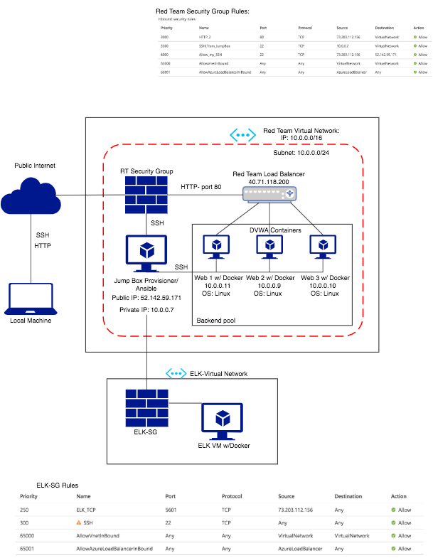
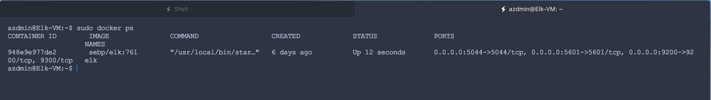

## Automated ELK Stack Deployment

The files in this repository were used to configure the network depicted below.



These files have been tested and used to generate a live ELK deployment on Azure. They can be used to recreate the entire deployment pictured above. Alternatively, select portions of the ansible playbook files may be used to install only certain pieces of it, such as Filebeat.

```
---
- name: Elk Stack Config  
  hosts: elk
  become: True
  tasks:

  - name: Increase virtual memory
    sysctl:
      name: vm.max_map_count
      value: "262144"
      state: present
      reload: yes

  - name: docker.io
    apt:
      force_apt_get: yes
      update_cache: yes
      name: docker.io
      state: present

  - name: Install pip3
    apt:
      force_apt_get: yes
      name: python3-pip
      state: present

  - name: Install Python Docker Module
    pip:
      name: docker
      state: present

  - name: Download and launch elk container
    docker_container:
      name: elk
      image: sebp/elk:761
      state: started
      restart_policy: always
      published_ports:
        - 5601:5601
        - 9200:9200
        - 5044:5044
```

This document contains the following details:

- Description of the Topology
- Access Policies
- ELK Configuration
  - Beats in Use
  - Machines Being Monitored
- How to Use the Ansible Build

### Description of the Topology

The main purpose of this network is to expose a load-balanced and monitored instance of DVWA, the D\*mn Vulnerable Web Application.

Load balancing ensures that the application will be highly available, in addition to restricting access to the network.

Integrating an ELK server allows users to easily monitor the vulnerable VMs for changes to their files and system analytics.

The configuration details of each machine may be found below.

| Name     | Function   | IP Address | Operating System |
| -------- | --------   | ---------- | ---------------- |
| Jump Box | Gateway    | 10.0.0.7   | Linux            |
| Web 1    | Web Server | 10.0.0.11  | Linux            |
| Web 2    | Web Server | 10.0.0.9   | Linux            |
| Web 3    | Web Server | 10.0.0.10  | Linux            |
| ELK      | Monitoring | 10.1.0.4   | Linux            |

### Access Policies

The machines on the internal network are not exposed to the public Internet.

Only the Jump-Box machine can accept connections from the Internet. Access to this machine is only allowed from the following IP addresses:

- 73.203.112.156

Machines within the network can only be accessed by each other.

A summary of the access policies in place can be found in the table below.

| Name     | Publicly Accessible | Allowed IP Addresses |
| -------- | ------------------- | -------------------- |
| Jump Box | Yes                 | 73.203.112.156       |
| Elk      | No                  | 10.0.0.1-254         |
| Web-1    | No                  | 10.0.0.1-254         |
| Web-2    | No                  | 10.0.0.1-254         |
| Web-3    | No                  | 10.0.0.1-254         |

### Elk Configuration

Ansible was used to automate configuration of the ELK machine. No configuration was performed manually, which is advantageous because it allows us to quickly duplicate the setup and configuration as necessary.

The playbook implements the following tasks:

- Increases Virtual Memory
- Installs docker
- Installs pip3
- Installs Python Docker module
- Downloads and launches Elk Container

The following screenshot displays the result of running `docker ps` after successfully configuring the ELK instance.



### Target Machines & Beats

This ELK server is configured to monitor the following machines:

- Web-1, with IP address 10.0.0.11, Web-2, with IP address 10.0.0.9 and Web-3, with web address 10.0.0.10.

We have installed the following Beats on these machines:

- Filebeat

These Beats allow us to collect the following information from each machine:

- Filebeat: Detects changes to the file system.

### Using the Playbook

In order to use the playbook, you will need to have an Ansible control node already configured. Assuming you have such a control node provisioned:

SSH into the control node and follow the steps below:

- Copy the filebeat-config.yml file to /etc/filebeat/filebeat.yml.
- Update the host file to include elk.
- Run the playbook, and navigate to http://104.40.19.4:5601/app/kibana to check that the installation worked as expected.

